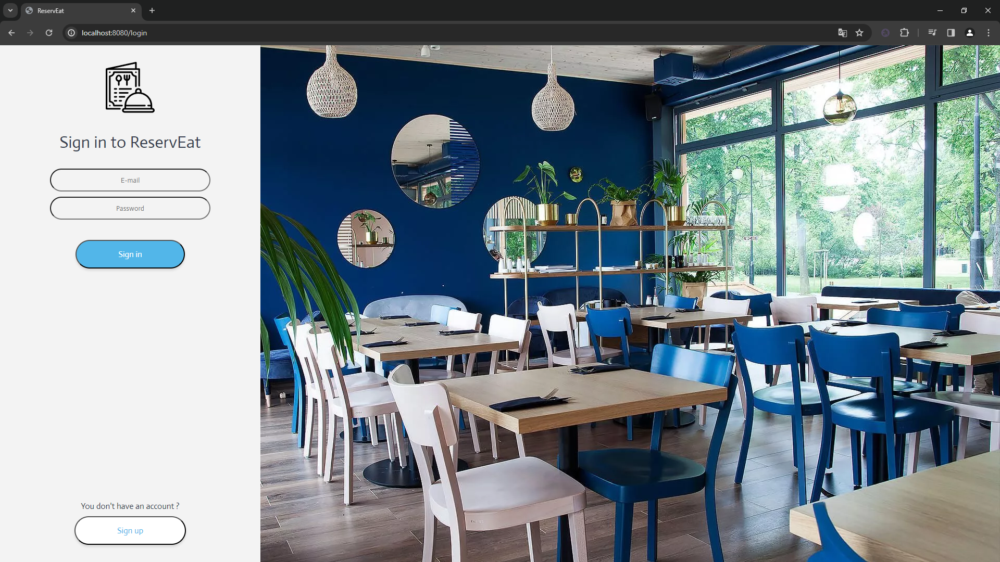

# WdPAI2324

# Online Restaurant Reservation Web Application

## Table of Contents

- [Introduction](#introduction)
- [Features](#features)
- [Prerequisites](#prerequisites)
- [Installation](#installation)
- [Technologies](#technologies)
- [Diagram ERD](#diagram-erd)
- [Screenshots from app](#screenshots-from-app)

## Introduction

Welcome to the Online Restaurant Reservation App project! This application aims to simplify the process of reserving tables in restaurants, providing users with convenience and flexibility in planning their dining experiences.

## Features

- User registration and authentication
- Restaurant search and browsing
- Reservation creation and management 
- Restaurant creation and management (only for admin)
- User ratings for restaurants

## Getting Started

Explain how to get your application up and running. This should include details on prerequisites and installation.

### Prerequisites

Before you begin, make sure you have the following software and services installed or set up:

- **Docker**: Install Docker on your machine. You can download Docker from [the official website](https://www.docker.com/get-started).

### Installation

Follow these steps to install and set up reservation app using Docker Compose:

1. **Clone the repository to your local machine.**
   ```bash
   git clone https://github.com/your-username/online-restaurant-reservation.git
   
2. **Build the Docker containers.**
   ```bash
    docker-compose build

3. **Start the application.**
   ```bash
    docker-compose up

### Technologies

- CSS
- HTML
- PHP
- JS
- DOCKER
- POSTGRESQL

### Diagram ERD


### Screenshots from app

Welcome page :


Login page :



Home page :


Restaurant page :


My reservation page :


